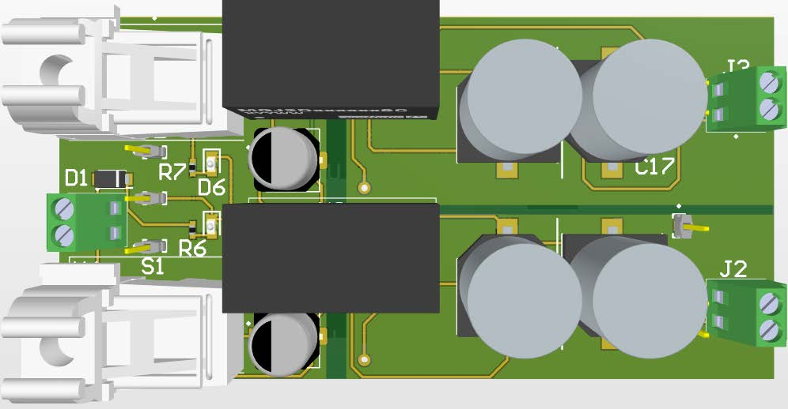
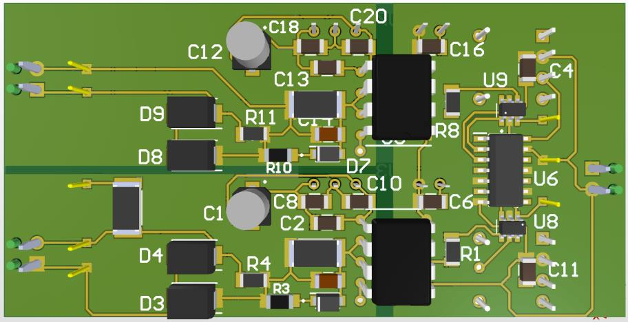

# Diseño de Driver de Potencia (Altium Designer) 

**Estado del Proyecto:** Diseño completado. El informe técnico completo está finalizado y disponible en este repositorio.

---

## 1. Vistas del Proyecto (Renders 3D)

**(Imagen 12: Vista Superior 3D)** 

**(Imagen 13: Vista Inferior 3D)** 

---

## 2. Resumen del Proyecto

Este repositorio contiene todos los archivos de diseño y la documentación técnica del rediseño y optimización de un **driver de potencia**. El proyecto fue desarrollado íntegramente en **Altium Designer** con el objetivo de mejorar la funcionalidad, seguridad y eficiencia de un diseño base, enfocado en aplicaciones de alta fiabilidad como las energías renovables.

Las mejoras clave incluyen la **integración de compuertas lógicas** para la protección de la etapa de control y una optimización robusta del layout para manejar altas corrientes y minimizar interferencias (EMI).

### ➡️ Informe Técnico Completo
Para un análisis detallado de la metodología, los cálculos de la norma IPC, la lista de materiales (BOM) y la discusión técnica, consulte el informe completo:

**[Ver Informe Técnico (PDF)](./JARH_Proyecto_Final.pdf)**

---

## 3. Herramientas y Metodología

* **Software Principal:** Altium Designer
* **Actividades Clave:**
    * Creación de Bibliotecas Personalizadas (Símbolos, Footprints y Modelos 3D).
    * Diseño de Esquemático y Layout de PCB (2 Capas).
    * Generación de Archivos de Fabricación.

---

## 4. Características Técnicas Destacadas

* **Diseño para Alta Corriente (IPC-2221):** Cálculo y aplicación de anchos de pista específicos para manejar hasta **9A**, basados en la norma IPC-2221 para pistas externas.
* **Integridad de Señal y Aislamiento:** Implementación de **planos de tierra (GND) sólidos** y ruteo estratégico para mantener el aislamiento galvánico.
* **Diseño para Fabricación (DFM):** Verificación del diseño contra las capacidades del fabricante y uso de reglas de diseño (DRC) para validación.
